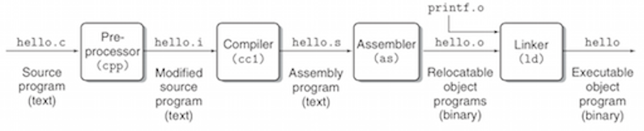

Computer Systems - A Programmer's Perspective
=============================================

## Chapter 1: A Tour of Computer Systems

### 1.1 Information Is Bits + Context
All information in a system—including disk files, programs stored in memory, user data stored in memory, and data transferred across a network—is represented as a bunch of bits. The only thing that distinguishes different data objects is the context in which we view them. For example, in different contexts, the same sequence of bytes might represent an integer, floating-point number, character string, or machine instruction.

### 1.2 Programs Are Translated by Other Programs into Different Forms
