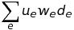

How to build a News Feed such as Facebook's news feed?
======================================================

#### Background
Users in most social networking sites are describable in terms of a social graph. The relationships between users are represented by adjacency lists. If Jack and Jill are friends, they are said to be adjacent. This is known as an "edge" in the graph.

#### Determininig Importance
You'll likely want to rank edges by importance rather than simply the most recent updates, meaning that you need to calculate some sort of score. Facebook's _EdgeRank_ was described by the formula 